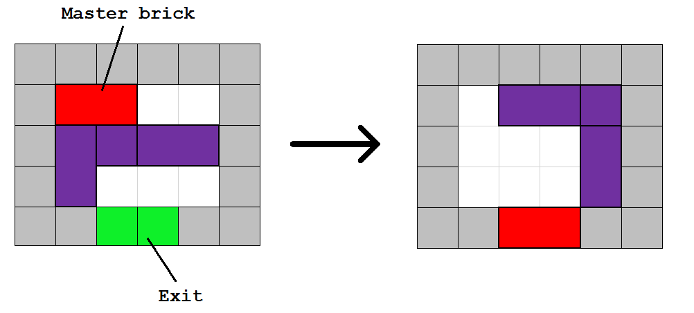
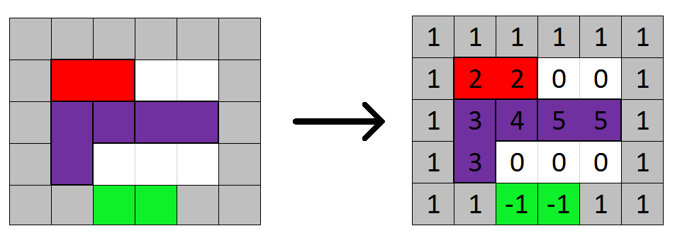
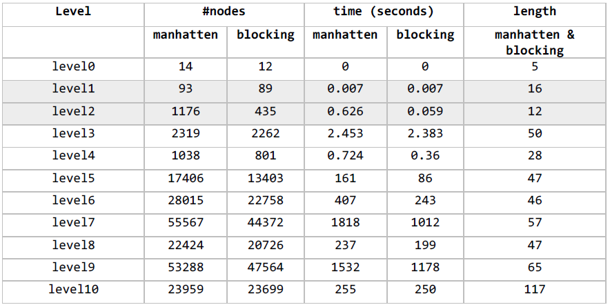
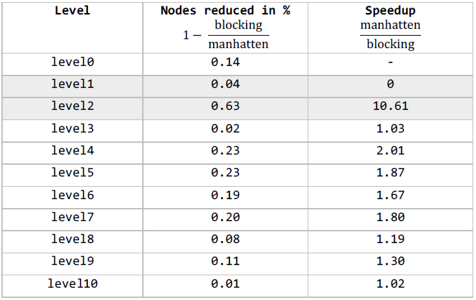

# Sliding Brick Puzzle
Solving a brick puzzle with different search algorithms

## Abstract
This repository contains a C++ implementation of different search algorithms
to solve a Sliding Brick Puzzle. The goal of the puzzle is to get the "Master brick" to the exit by shifting bricks around. The concept is illustrated in the image below.

<p align="center">
	
</p>

The "game world" proves to be a good testing ground for applying search algorithms and evaluating them.

**Algorithms**
* [Breadth-first search](https://en.wikipedia.org/wiki/Breadth-first_search)
* [Depth-first search](https://en.wikipedia.org/wiki/Depth-first_search)
* [Iterative deepening depth-first search](https://en.wikipedia.org/wiki/Iterative_deepening_depth-first_search)
* [A* search](https://en.wikipedia.org/wiki/A*_search_algorithm)

## Theory
It is assumed that the reader is familiar
with the basic concepts of different search algorithms and terms like 
complete, optimal ..etc.

TODO

TODO see doc/pdfs for more detailed descriptions!

## Implementation
The game world is represented by a 2D grid. Every brick is a number. The example puzzle from above *(the Abstract chapter)* translates to the following. 
<p align="center">
	
</p>

The following table describes the meaning of each value.

| Value         | Description     |
| :-----------: | :-------------- |
| -1            | exit (goal)     |
| 0             | empty field     |
| 1             | wall            |
| 2             | master brick    |
| >2            | each of the other bricks|


**Classes**
* Search
  * Encapsulates the search algorithms, functions to run them and
    print their results
* Node
  * Represents a node in a tree. It holds the current state of the puzzle (Matrix) as well as a reference to it's parent node
* CostNode
  * Represents a node with a weight (cost) in a tree. The class is derived from
    Node. The only extension is a member variable that holds the cost. This node is used for the A* search algorithm
* Matrix
  * Represents the state of a puzzle. It's width, height and all the cells values

The code is designed to be modular to add new algorithms without a hitch.
  
## How do i run this code?
### Requirements
CMake, GCC and C++11
### Running the code
Clone or download the repository.

Run CMake in the top level directory where the file "CMakeLists.txt" is
```
$ cmake .
```

Then create an executable named `sbp`
```
$ make
```
Run the executable
```
$ ./sbp
```
By default, this will run all search algorithms on the first two level and give you something like the following output. (Change the main.cpp and all the other files as you need/like)
```
----- level0 -----
BFS
#nodes: 19  time: 0.001s  length: 5
DFS
#nodes: 10  time: 0s  length: 9
IDDFS
#nodes: 82  time: 0.003s  length: 5
A* manhatten
#nodes: 14  time: 0.001s  length: 5
A* blocking
#nodes: 12  time: 0s  length: 5

----- level1 -----
BFS
#nodes: 100  time: 0.024s  length: 16
DFS
#nodes: 69  time: 0.021s  length: 49
IDDFS
#nodes: 37060  time: 98.451s  length: 16
A* manhatten
#nodes: 93  time: 0.019s  length: 16
A* blocking
#nodes: 89  time: 0.055s  length: 16
```
**#nodes** = the number of nodes that were explored during the search

**time** = time needed to find the solution

**length** = number of moves necessary to get to the solution (i.e. the length of the solution)

The actual moves that solve the level and hide behind the *length* parameter can be printed to the console when passing `true` to the function `Search::printResults` in main.cpp.

## Results
*Note: the levels are not necessarily always increasing in difficulty with their number in the name  of the file!*

A test run on `level1.txt` gives the following data.

|        | BFS     | DFS     | IDDFS    | A* Manhatten | A* blocking |
| :----: | :-----: | :-----: | :------: | :----------: | :---------: |
| #nodes | 110     | 64      | 33038    | 93           | 88          |
| time   | 0.002   | 0.002   | 8.673    | 0.002        | 0.002       |
| length | 16      | 60      | 16       | 16           | 16          |
The optimal solution length is 16, which every algorithm except for the **DFS** found. The DFS is a complete, but non-optimal search in this case. It is worth mentioning, that the **IDDFS** searches the most nodes, due to it's nature of always starting at the root node again after hitting the current depth limit. Therefore, the number of explored nodes contains many duplicates! Although this search is complete and optimal after all, the algorithm does not seem feasible for more complex levels. The **A\* blocking** algorithm yields the best results because it finds the optimal solution by exploring the fewest nodes in the process.

To give a little more insight on runtimes, here are example runtimes for all algorithms for the first four levels. If not indicated otherwise, the runtime is denoted in seconds.

|        | BFS     | DFS     | IDDFS    | A* Manhatten | A* blocking |
| :----: | :-----: | :-----: | :------: | :----------: | :---------: |
| level0 | 0       | 0       | 0        | 0            | 0           |
| level1 | 0.002   | 0.002   | 8.673    | 0.002        | 0.002       |
| level2 | 0.389   | 0.023   | >1 h     | 0.138        | 0.020       |
| level3 | 0.518   | 0.077   | ??       | 0.671        | 0.660       |

It is also worth comparing the A* algorithm with both heuristic options, the Manhatten distance and the blocking heuristic. The following table compares the two heurstics for all levels.

<p align="center">
	
</p>

Both heuristic functions output the optimal solution (length). The number of
explored nodes and the time can be used to calculate the percentage of nodes reduced and the Speedup, respectively.

<p align="center">
	
</p>

It is worth mentioning that the blocking heuristic does not provide a general Speedup of a fixed value. The best Speedup was measured for level2 at 10.61. In case of level10 the Speedup is almost non-existent, because the number of
explored nodes could only be reduced by a few compared to the Manhatten distance.

